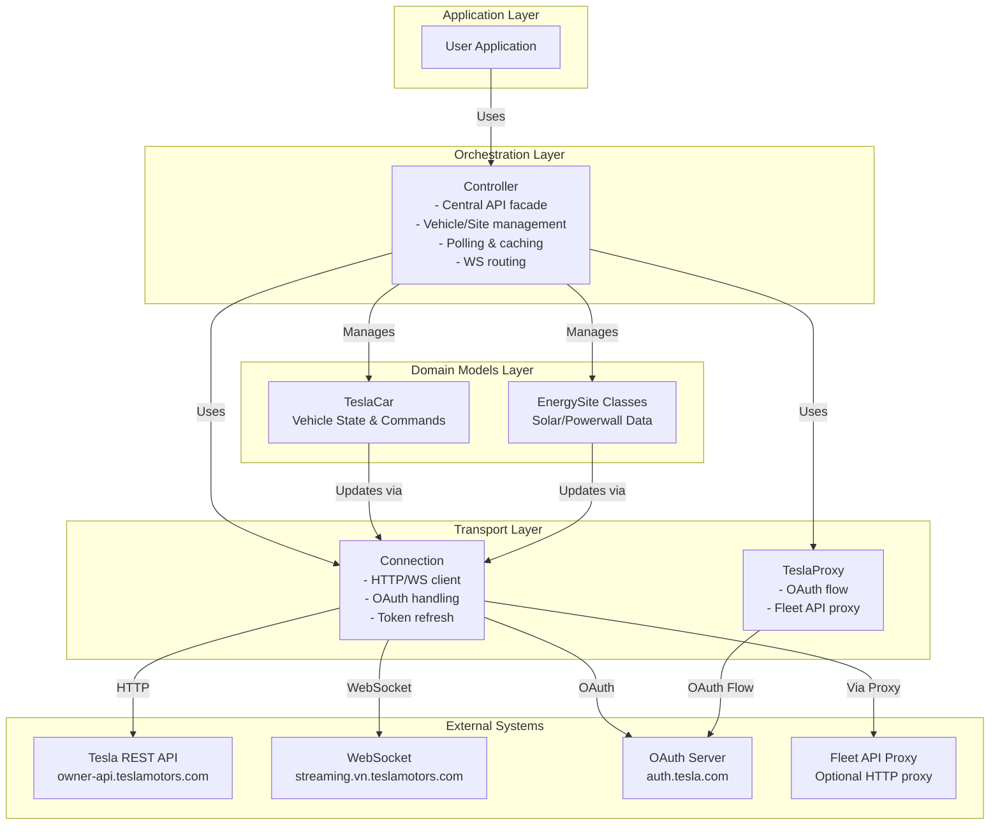
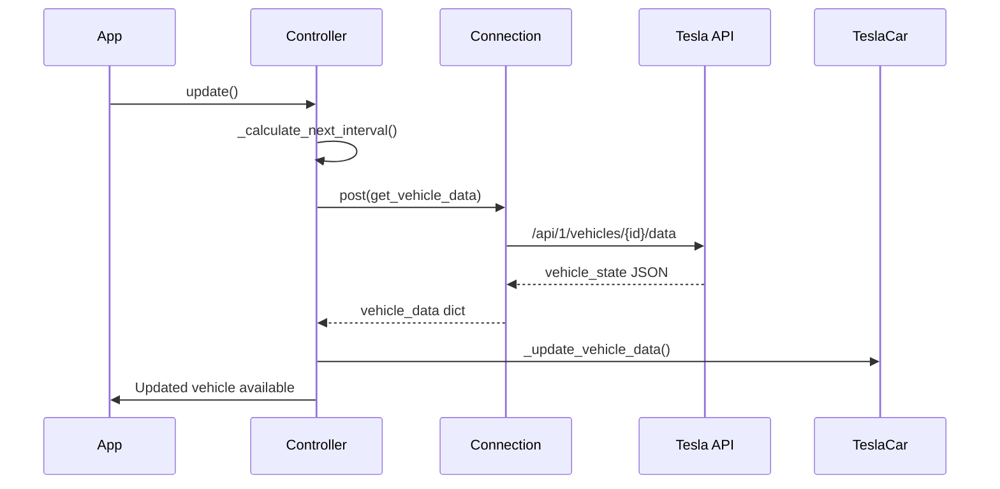
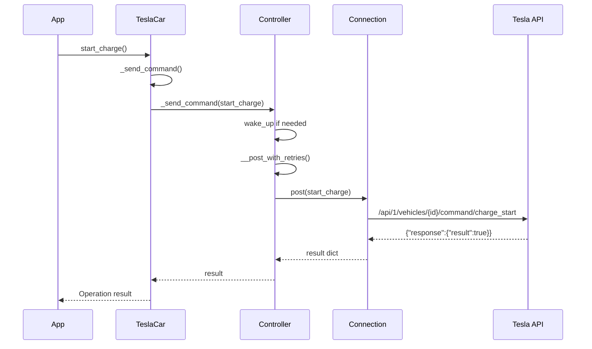
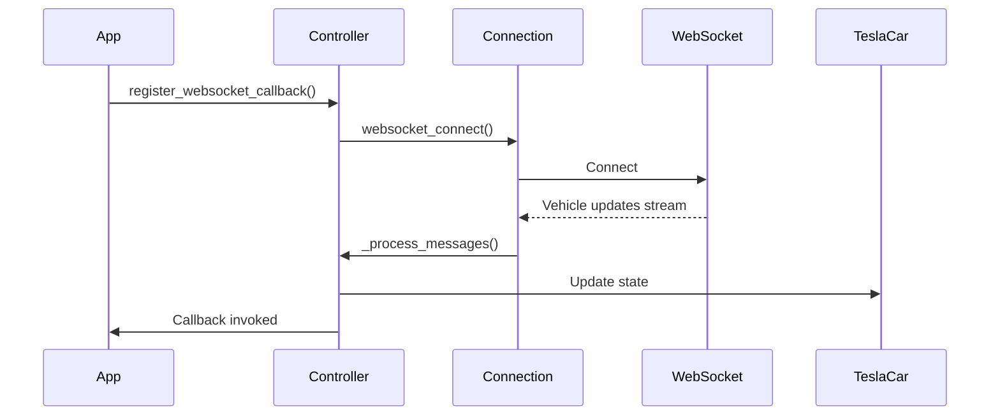

# Architecture

## System Overview

teslajsonpy is an async Python library that provides a layered abstraction over the Tesla REST API. The architecture follows a clear separation of concerns: low-level HTTP handling, high-level orchestration, and domain-specific models.

### Architecture Layers



## Component Responsibilities

### Connection (connection.py)

**Purpose**: Low-level HTTP and WebSocket communication with OAuth authentication.

**Key Responsibilities**:
- Manage HTTP sessions and WebSocket connections
- Handle OAuth2 authentication flow
- Refresh access tokens before expiration
- Process API responses and error handling
- Manage connection lifecycle

**Key Methods**:
- `get_authorization_code_link()` - Generate OAuth authorization URL
- `get_authorization_code()` - Exchange code for tokens
- `get_bearer_token()` - Get/refresh bearer token
- `post()` / `get()` - HTTP operations
- `websocket_connect()` - Establish WebSocket connection

**Key State**:
- `access_token` - Current Bearer token
- `refresh_token` - Token refresh credential
- `id_token` - Identity token
- `expiration` - Token expiration timestamp
- `code_verifier` / `code_challenge` - PKCE parameters

### Controller (controller.py)

**Purpose**: High-level orchestration and API facade.

**Key Responsibilities**:
- Manage collections of vehicles and energy sites
- Throttle polling to prevent API rate limiting
- Cache vehicle and site data
- Route WebSocket messages to appropriate objects
- Provide unified API for state queries and commands
- Handle vehicle wake-up before commands

**Key Methods**:
- `connect()` - Initialize connection
- `get_vehicles()` / `get_energysites()` - Query product list
- `get_vehicle_data()` - Fetch all vehicle data
- `get_site_data()` - Fetch energy site data
- `update()` - Poll all data with throttling
- `register_websocket_callback()` - Listen for real-time updates

**Polling Strategy**:
```
DRIVING_INTERVAL = 60s   (actively driving)
UPDATE_INTERVAL = 300s   (parked, awake)
IDLE_INTERVAL = 600s     (parked, may sleep)
SLEEP_INTERVAL = 660s    (sleeping, don't poll)
ONLINE_INTERVAL = 60s    (check if online)
WAKE_TIMEOUT = 60s       (max time to wait for wake)
```

**Caching Pattern**:
- Cached via properties with last-update timestamp
- Automatic refresh when data expires
- WebSocket updates bypass polling for real-time response

### TeslaCar (car.py)

**Purpose**: Object model representing a single vehicle with state and commands.

**Key Responsibilities**:
- Expose vehicle state through read-only properties (100+ properties)
- Provide command methods for vehicle control
- Parse and structure vehicle data from API responses
- Maintain climate state history for change detection

**State Properties** (read-only):
```
Identification:
  - vin, vehicle_id, id, display_name, state

Battery & Charging:
  - battery_level, usable_battery_level, battery_range
  - charging_state, charge_rate, charge_limit_soc
  - charger_power, charger_voltage, charger_phases

Climate:
  - inside_temp, outside_temp, driver_temp_setting, passenger_temp_setting
  - is_climate_on, defrost_mode, cabin_overheat_protection

Doors & Locks:
  - is_locked, is_frunk_closed, is_trunk_closed
  - door_df, door_dr, door_pf, door_pr, door_rp, door_rd

Location & Navigation:
  - latitude, longitude, heading, speed
  - active_route_destination, active_route_miles_to_arrival

And 80+ more properties...
```

**Command Methods** (async):
```
Climate:
  - set_temperature(temp)
  - set_hvac_mode(mode)
  - set_max_defrost(defrost)
  - set_climate_keeper_mode(mode)
  - set_cabin_overheat_protection(mode)

Charging:
  - start_charge(), stop_charge()
  - set_charging_amps(amps)
  - change_charge_limit(soc)
  - set_scheduled_charging(start_time, enable)
  - set_scheduled_departure(departure_time, enable, preconditioning_enabled)

Door/Window Control:
  - lock(), unlock()
  - toggle_frunk(), toggle_trunk()
  - charge_port_door_open(), charge_port_door_close()
  - close_windows(), vent_windows()

Climate Seat Control:
  - set_heated_steering_wheel(level)
  - set_heated_steering_wheel_level(level)
  - remote_seat_heater_request(heater_type, level)
  - remote_seat_cooler_request(cooler_type, level)
  - set_auto_seat_climate_request(auto_climate_left, auto_climate_right)

Lighting & Sounds:
  - flash_lights(), honk_horn()
  - remote_boombox(sound)

Other:
  - remote_start(password)
  - wake_up()
  - trigger_homelink()
  - set_sentry_mode(enable)
  - set_valet_mode(enable, pin)
```

### EnergySite & Subclasses (energy.py)

**Purpose**: Object models for Tesla energy products (Solar, Powerwall).

**Class Hierarchy**:
```
EnergySite (base class)
├── SolarSite
├── PowerwallSite
└── SolarPowerwallSite
```

**Responsibilities**:
- Expose energy resource data through properties
- Handle API calls for energy configuration changes
- Support multiple resource types (solar, battery, load_meter)

**Key Properties**:
```
Energy Data:
  - solar_power, grid_power, load_power, battery_power
  - grid_status, percentage_charged, energy_left
  - backup_reserve_percent
  
Configuration:
  - operation_mode, export_rule
  - reserve_percent
  
Identification:
  - energysite_id, site_name, resource_type
```

**Command Methods** (async):
```
  - set_reserve_percent(percent)
  - set_operation_mode(mode)
  - set_export_rule(rule_data)
  - set_grid_charging(enable, charge_amps)
```

### Exception Hierarchy (exceptions.py)

```
TeslaException (base)
├── IncompleteCredentials
├── RetryLimitError
├── HomelinkError
├── UnknownPresetMode

Decorators:
├── @custom_retry() - Retry with exponential backoff
├── @custom_retry_except_unavailable() - Retry except 408
└── @custom_wait() - Custom wait function for retries
```

### TeslaProxy (teslaproxy.py)

**Purpose**: OAuth proxy handler for authentication flow.

**Responsibilities**:
- Intercept OAuth redirect
- Capture authorization code
- Handle HTML/JS response modifications
- Support WAF (Web Application Firewall) bypass

**Key Methods**:
- `test_url()` - Verify successful authorization
- `prepend_relative_urls()` - Fix relative URLs in HTML
- `prepend_i18n_path()` - Fix i18n paths in JavaScript

## Data Flow Patterns

### Vehicle Update Flow



### Command Execution Flow



### WebSocket Flow



## Caching Strategy

### Vehicle Data Cache

The Controller maintains a multi-level cache:

1. **Full Vehicle Data** - cached from `/vehicles/{id}/data`
   - Refreshed per polling interval
   - Contains all state parameters

2. **Individual Parameters** - extracted subsets
   - `get_climate_params()` - Returns cached climate state
   - `get_charging_params()` - Returns cached charging state
   - `get_state_params()` - Returns cached drive state
   - `get_config_params()` - Returns cached vehicle config
   - `get_drive_params()` - Returns cached drive params
   - `get_gui_params()` - Returns cached GUI settings

3. **Last Update Tracking**
   - `_last_update_time` - Timestamp of last poll
   - Used to determine if refresh needed

### Invalidation

- Manual: `disconnect()` clears all cache
- Automatic: WebSocket updates trigger immediate cache refresh
- Time-based: Next scheduled poll updates all cache

## Error Handling Strategy

### Retry Logic

```python
@custom_retry(retries=3, wait_time=1)  # Retry 3 times with exponential backoff
@custom_retry_except_unavailable()      # Don't retry 408 errors
```

### Error Mapping

HTTP Status Code → TeslaException Message:
- 401 → UNAUTHORIZED (token refresh needed)
- 404 → NOT_FOUND
- 405 → MOBILE_ACCESS_DISABLED
- 408 → VEHICLE_UNAVAILABLE
- 423 → ACCOUNT_LOCKED
- 429 → TOO_MANY_REQUESTS
- 500 → SERVER_ERROR
- 503 → SERVICE_MAINTENANCE
- 504 → UPSTREAM_TIMEOUT

### Vehicle Wake-Up

When vehicle is asleep:
1. Issue wake command
2. Wait up to WAKE_TIMEOUT (60s)
3. Poll at WAKE_CHECK_INTERVAL (2s) until awake
4. Then execute desired command

## Integration Points

### Home Assistant Integration

Home Assistant consumes teslajsonpy through:

1. **Entity Discovery**
   ```python
   cars = controller.generate_car_objects()
   energysites = controller.generate_energysite_objects()
   ```

2. **State Updates**
   - Register callback: `controller.register_websocket_callback(callback)`
   - Updates arrive asynchronously

3. **Command Execution**
   - Call command methods: `car.start_charge()`
   - Handle async/await properly

4. **Configuration**
   - OAuth through TeslaProxy
   - Store tokens persistently
   - Refresh before expiration

### Fleet API Support

For modern vehicles requiring HTTP proxy:

1. Create proxy container with Tesla's vehicle-command
2. Obtain Client ID and Proxy URL
3. Initialize Controller with:
   - `client_id=your_client_id`
   - `api_proxy_url=https://your-proxy:4430`
4. VIN used instead of vehicle_id in API calls

## Performance Considerations

### Polling Optimization

- Adaptive intervals based on vehicle state
- Sleep interval prevents unnecessary API calls
- Online status cached to avoid per-vehicle checks

### Request Batching

- Single `/vehicles/{id}/data` call gets all state
- Controller extracts subsets without new API calls

### Connection Reuse

- Single httpx.AsyncClient for all requests
- WebSocket connection maintained for real-time updates
- Token cached and refreshed transparently

### Memory Efficiency

- Only active vehicles/sites held in memory
- Circular history for climate change detection
- Minimal object allocation in polling loop
