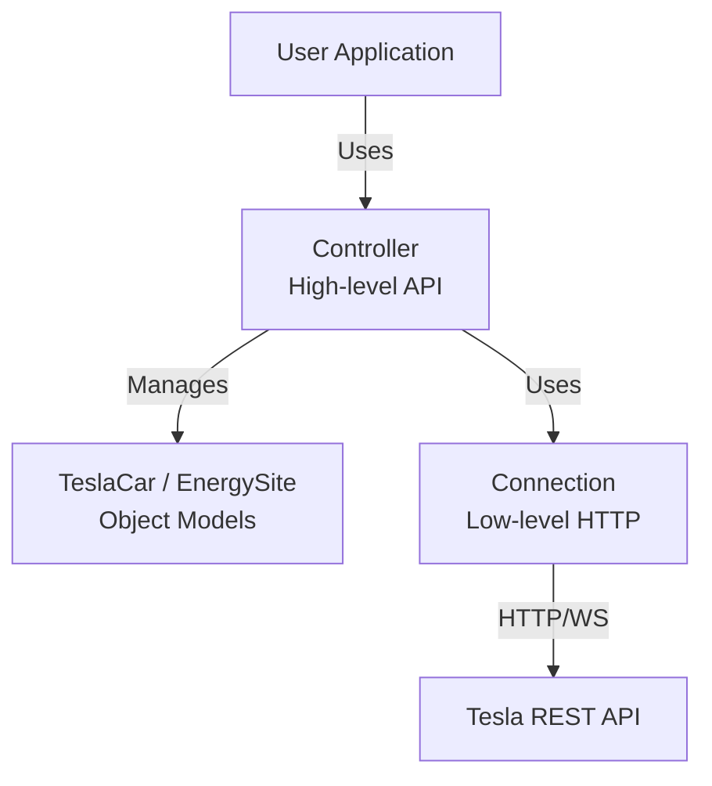

# Codebase Information: teslajsonpy

## Project Overview

**teslajsonpy** is an asynchronous Python library for controlling the Tesla API. It provides high-level abstractions for interacting with Tesla vehicles and energy systems (Powerwalls, Solar installations) through Tesla's REST API.

- **Language**: Python 3.7+
- **Version**: 3.13.2
- **License**: Apache-2.0
- **Repository**: https://github.com/zabuldon/teslajsonpy
- **Documentation**: https://teslajsonpy.readthedocs.io
- **Status**: Alpha (Development Status :: 3)

## Codebase Statistics

```
Total Files: 273
Python Source Files: 45 (prioritized for analysis)
Lines of Code: ~48,000
Classes/Structs: 14
Functions: 1079
```

## Core Architecture

### Layered Design



### Module Organization

The codebase is organized into several key modules:

1. **connection.py** (645 LOC, 14 functions)
   - Low-level HTTP/WebSocket client
   - OAuth authentication and token refresh
   - Direct Tesla API communication

2. **controller.py** (1460 LOC, 186 functions)
   - High-level orchestration layer
   - Vehicle and energy site management
   - Caching and throttling logic
   - WebSocket message routing

3. **car.py** (1395 LOC, 328 functions)
   - TeslaCar object model
   - 100+ properties for vehicle state
   - 35+ command methods (lock, charge, climate, etc.)
   - Climate and charging state management

4. **energy.py** (289 LOC, 76 functions)
   - EnergySite base class
   - Specialized classes: SolarSite, PowerwallSite, SolarPowerwallSite
   - Energy resource management

5. **exceptions.py** (142 LOC, 30 functions)
   - Custom exception classes
   - Retry decorators (@custom_retry, @custom_retry_except_unavailable)
   - Error handling and recovery logic

6. **teslaproxy.py** (204 LOC, 33 functions)
   - OAuth proxy for authentication flow
   - Modern Fleet API support via HTTP proxy

7. **const.py** (36 LOC)
   - Constants for polling intervals, API URLs, resource types
   - Configuration defaults

## Technology Stack

### Core Dependencies

| Package | Purpose | Version |
|---------|---------|---------|
| aiohttp | HTTP client with streaming | >=3.7.4 |
| httpx | Modern async HTTP client | >=0.17.1, <1.0 |
| tenacity | Automatic retry logic | >=8.1.0 |
| beautifulsoup4 | HTML parsing for OAuth | >=4.9.3 |
| orjson | Fast JSON serialization | >=3.8.5 |
| wrapt | Function wrapping utilities | >=1.12.1 |
| authcaptureproxy | OAuth proxy framework | >=1.1.3 |

### Development Dependencies

- **Testing**: pytest, pytest-asyncio, pytest-cov, coverage
- **Linting**: flake8, pylint, pydocstyle
- **Type Checking**: mypy
- **Formatting**: black
- **Documentation**: Sphinx, sphinx-rtd-theme, autoapi, m2r2
- **Build**: Poetry (poetry-core)

## Key Components

### Classes

1. **Connection** - HTTP/WS client with OAuth
2. **Controller** - Central orchestration (API and vehicle/energy management)
3. **TeslaCar** - Single vehicle representation and commands
4. **EnergySite** - Base class for energy resources
5. **SolarSite**, **PowerwallSite**, **SolarPowerwallSite** - Specialized energy types
6. **TeslaProxy** - OAuth proxy handler
7. **TeslaException** - Custom exception hierarchy

### Data Models

- **Vehicle State**: battery_level, charge_state, climate_state, drive_state, etc.
- **Energy Data**: grid_power, load_power, solar_power, battery_power
- **Commands**: charge, lock, climate control, window control, scheduled events

## Supported Features

### Vehicle Operations
- Climate control (temperature, HVAC mode, defrost)
- Charging (start/stop, set limit, set amps)
- Locking/unlocking
- Light controls (flash, honk)
- Door controls (frunk, trunk, charge port)
- Window controls (open, close, vent)
- Seat heating/cooling
- Sentry mode
- Remote start

### Energy Management
- Grid power monitoring
- Solar production monitoring
- Battery charging/discharging
- Load monitoring
- Export rule configuration
- Reserve percentage setting

### Authentication
- Email/password authentication
- OAuth2 with authorization code flow
- Token refresh and expiration handling
- HTTP proxy support for Fleet API

## Architecture Patterns

### Async-First Design
- All API calls are async/await
- Uses httpx and aiohttp for non-blocking I/O
- WebSocket support for real-time updates

### Object-Oriented Model
- Controller manages collections of vehicles and energy sites
- Each vehicle is a TeslaCar instance with rich property API
- Clean separation between command methods and state properties

### Caching Strategy
- get_climate_params, get_charging_params cached
- State params (climate, drive, charging, gui, config) cached
- Controller manages cache invalidation

### Error Handling
- Custom retry decorators with exponential backoff
- Graceful handling of vehicle unavailability
- API rate limit handling (429 Too Many Requests)

### Polling Strategy
- Adaptive intervals based on vehicle state (DRIVING_INTERVAL, UPDATE_INTERVAL, SLEEP_INTERVAL)
- WebSocket for real-time updates when available
- Fallback to polling for compatibility

## Integration Points

### Home Assistant
- Primary intended consumer
- Vehicle and energy entities through custom abstractions
- Discovery through controller's generate_car_objects() / generate_energysite_objects()

### Tesla API
- Owner API (legacy): owner-api.teslamotors.com
- Fleet API (modern): via HTTP proxy
- WebSocket streaming: streaming.vn.teslamotors.com
- OAuth: auth.tesla.com

### Configuration
- Optional HTTP proxy for Fleet API
- Client ID customization
- Auth domain support (US, China)
- SSL certificate handling for self-signed proxies

## Testing Structure

```
tests/
├── unit_tests/
│   ├── test_car.py          (34 tests for TeslaCar)
│   ├── test_energy.py        (8 tests for energy sites)
│   ├── test_polling_interval.py (6 tests for polling)
│   └── test_exceptions.py    (3 tests for error handling)
├── test_tesla_exception.py   (16 tests for exceptions)
└── tesla_mock.py             (Mock implementation for testing)
```

## Development Workflow

- **Build Tool**: Poetry
- **Testing**: pytest with async support
- **Coverage**: 100% code coverage required
- **Linting**: flake8, pylint, pydocstyle
- **Type Checking**: mypy
- **Formatting**: black
- **Release**: Semantic versioning with GitHub Actions

## Known Patterns & Conventions

1. **Logging**: Module-level logger via `_LOGGER = logging.getLogger(__name__)`
2. **Async Pattern**: All I/O operations are async
3. **Property Pattern**: Vehicle state exposed as @property methods
4. **Command Pattern**: State-changing operations as async methods
5. **Retry Pattern**: Decorators handle retry logic transparently
6. **Error Codes**: HTTP error codes mapped to meaningful TeslaException messages
7. **Cache Keys**: Vehicle data organized by vin, vehicle_id, and id

## File Organization

```
teslajsonpy/
├── __init__.py           (Public API exports)
├── __version__.py        (Version string)
├── connection.py         (Low-level HTTP/OAuth)
├── controller.py         (High-level orchestration)
├── car.py                (Vehicle model)
├── energy.py             (Energy resource models)
├── exceptions.py         (Error handling)
├── teslaproxy.py         (OAuth proxy)
├── const.py              (Constants)
└── endpoints.json        (Tesla API endpoint definitions)
```

## API Design Principles

1. **Simplicity**: High-level Controller API hides complexity
2. **Non-blocking**: All operations are async
3. **Resilience**: Built-in retry and error recovery
4. **Caching**: Reduces API calls through intelligent caching
5. **Type Safety**: Type hints throughout
6. **Extensibility**: Easy to add new vehicle commands or energy operations
