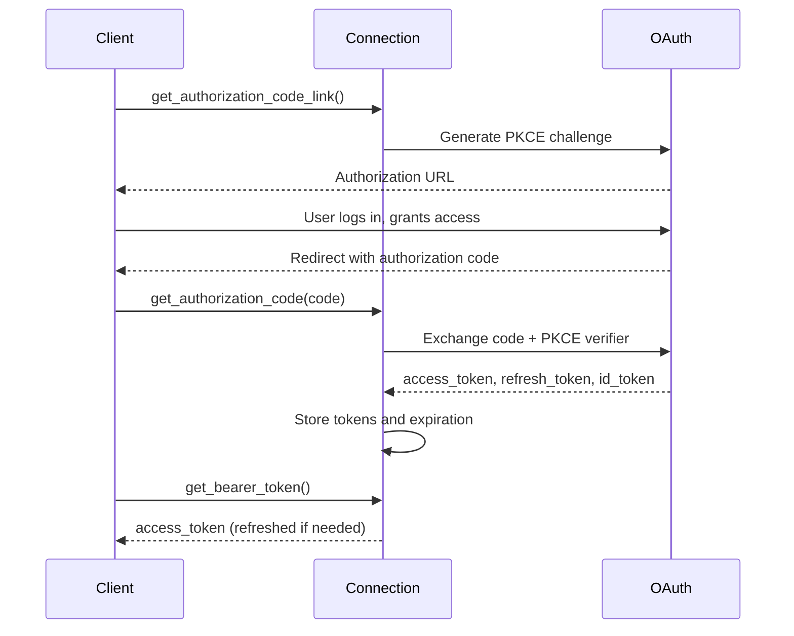
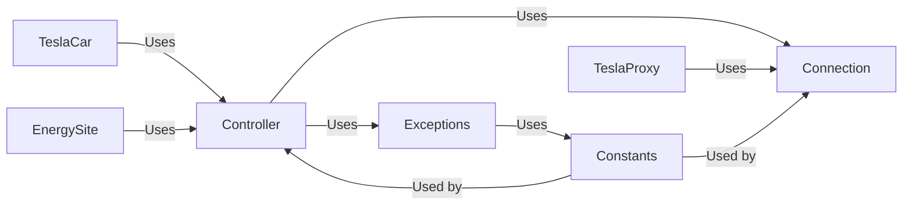

# Components

## Overview

teslajsonpy consists of seven primary components, each with distinct responsibilities. This document describes their purposes, interfaces, and interactions.

## 1. Connection Component

**File**: `connection.py`  
**Purpose**: Low-level HTTP and WebSocket communication with OAuth authentication  
**Scope**: 645 LOC, 14 key functions

### Responsibilities

- Manage HTTP sessions via httpx.AsyncClient
- Handle OAuth2 authentication flow (PKCE, authorization code)
- Maintain and refresh access tokens
- Execute HTTP requests (GET, POST)
- Establish and manage WebSocket connections
- Process API responses and errors

### Key Classes

**Connection**
```python
class Connection:
    def __init__(
        self,
        websession: httpx.AsyncClient,
        email: str = None,
        password: str = None,
        access_token: str = None,
        refresh_token: str = None,
        authorization_token: str = None,
        expiration: int = 0,
        auth_domain: str = AUTH_DOMAIN,
        client_id: str = CLIENT_ID,
        api_proxy_url: str = None
    )
```

### Key Methods

| Method | Purpose | Returns |
|--------|---------|---------|
| `get_authorization_code_link()` | Generate OAuth authorize URL | str (URL) |
| `get_authorization_code(code, state)` | Exchange auth code for tokens | bool |
| `get_bearer_token()` | Get current/refreshed bearer token | str |
| `refresh_access_token()` | Refresh expired token | bool |
| `get_sso_auth_token()` | Get SSO auth token | dict |
| `post(command, **kwargs)` | Execute POST request | dict |
| `get(path, **kwargs)` | Execute GET request | dict |
| `websocket_connect(on_message, on_error)` | Create WebSocket connection | Task |
| `close()` | Close HTTP and WebSocket | None |

### Authentication Flow



### State

| Property | Type | Purpose |
|----------|------|---------|
| `websession` | httpx.AsyncClient | HTTP client |
| `access_token` | str | Current Bearer token |
| `refresh_token` | str | Token refresh credential |
| `id_token` | str | Identity token |
| `expiration` | int | Unix timestamp for expiration |
| `code_verifier` | str | PKCE code verifier |
| `code_challenge` | str | PKCE code challenge |
| `baseurl` | str | Tesla API base URL |
| `websocket_url` | str | WebSocket URL |

## 2. Controller Component

**File**: `controller.py`  
**Purpose**: High-level orchestration, caching, and throttling  
**Scope**: 1460 LOC, 186 key functions

### Responsibilities

- Manage collections of TeslaCar and EnergySite objects
- Implement polling with adaptive intervals
- Cache vehicle and site data
- Route WebSocket messages
- Throttle API calls to prevent rate limiting
- Wake up sleeping vehicles before commands

### Key Classes

**Controller**
```python
class Controller:
    def __init__(
        self,
        websession: httpx.AsyncClient,
        email: str,
        password: str = None,
        access_token: str = None,
        ...
    )
```

### Polling Strategy

```python
# Dynamic interval selection
if state == "DRIVING":
    interval = DRIVING_INTERVAL  # 60s
elif state == "PARKED":
    if last_activity < SLEEP_INTERVAL:
        interval = IDLE_INTERVAL  # 600s
    else:
        interval = SLEEP_INTERVAL  # 660s (don't poll)
else:
    interval = UPDATE_INTERVAL  # 300s
```

### Key Methods

| Method | Purpose |
|--------|---------|
| `connect()` | Initialize connection |
| `disconnect()` | Close connection and clear cache |
| `update()` | Poll all vehicle/site data |
| `get_vehicle_data(vin)` | Fetch data for single vehicle |
| `get_site_data(site_id)` | Fetch data for energy site |
| `get_vehicles()` | Get list of TeslaCar objects |
| `get_energysites()` | Get list of EnergySite objects |
| `register_websocket_callback(callback)` | Listen for real-time updates |
| `set_authorization_code(code)` | Set OAuth code |
| `get_oauth_url()` | Get OAuth authorize URL |

### Caching Pattern

```python
# Cached methods return extracted subsets
vehicle_data = controller.get_vehicle_data(vin)  # Full cache
climate = controller.get_climate_params(vin)     # Subset from cache
charging = controller.get_charging_params(vin)   # Subset from cache
```

## 3. TeslaCar Component

**File**: `car.py`  
**Purpose**: Vehicle state model and command interface  
**Scope**: 1395 LOC, 328 functions

### Responsibilities

- Expose vehicle state as read-only properties (100+)
- Provide command methods for vehicle control (35+)
- Parse and structure vehicle data
- Track climate state history

### Key Class

**TeslaCar**
```python
class TeslaCar:
    def __init__(
        self,
        car: dict,
        controller: Controller,
        vehicle_data: dict
    )
```

### State Properties

Organized by category:

**Identification**
```python
@property
def vin(self) -> str: ...
@property
def vehicle_id(self) -> int: ...
@property
def id(self) -> int: ...
@property
def state(self) -> str: ...  # "online", "offline", "sleeping"
```

**Battery & Charging** (20+ properties)
```python
@property
def battery_level(self) -> int: ...  # 0-100
@property
def battery_range(self) -> float: ...  # miles/km
@property
def charging_state(self) -> str: ...  # "Charging", "Discharging", "Stopped", "Complete"
@property
def charge_limit_soc(self) -> int: ...  # 50-100
@property
def charge_rate(self) -> float: ...  # miles/km added per hour
```

**Climate** (15+ properties)
```python
@property
def inside_temp(self) -> float: ...
@property
def outside_temp(self) -> float: ...
@property
def is_climate_on(self) -> bool: ...
@property
def driver_temp_setting(self) -> float: ...
```

**Location** (10+ properties)
```python
@property
def latitude(self) -> float: ...
@property
def longitude(self) -> float: ...
@property
def heading(self) -> int: ...  # 0-359 degrees
@property
def speed(self) -> int: ...  # mph/kph
```

### Command Methods (35+)

**Climate Control**
```python
async def set_temperature(self, temp: float) -> dict: ...
async def set_hvac_mode(self, mode: str) -> dict: ...
async def set_max_defrost(self, defrost: bool) -> dict: ...
async def set_climate_keeper_mode(self, mode: int) -> dict: ...
```

**Charging**
```python
async def start_charge(self) -> dict: ...
async def stop_charge(self) -> dict: ...
async def set_charging_amps(self, amps: int) -> dict: ...
async def change_charge_limit(self, soc: int) -> dict: ...
async def set_scheduled_charging(self, start_time: int, enable: bool) -> dict: ...
```

**Access Control**
```python
async def lock(self) -> dict: ...
async def unlock(self) -> dict: ...
async def trigger_homelink(self) -> dict: ...
```

**Door/Window**
```python
async def toggle_frunk(self) -> dict: ...
async def toggle_trunk(self) -> dict: ...
async def close_windows(self) -> dict: ...
async def vent_windows(self) -> dict: ...
async def charge_port_door_open(self) -> dict: ...
async def charge_port_door_close(self) -> dict: ...
```

**Lighting**
```python
async def flash_lights(self) -> dict: ...
async def honk_horn(self) -> dict: ...
```

## 4. Energy Component

**File**: `energy.py`  
**Purpose**: Energy resource models (Solar, Powerwall)  
**Scope**: 289 LOC, 76 functions

### Class Hierarchy

```
EnergySite (base)
├── SolarSite
├── PowerwallSite
└── SolarPowerwallSite
```

### EnergySite (Base Class)

**Purpose**: Abstract base for all energy resources

**Properties**
```python
@property
def energysite_id(self) -> int: ...
@property
def resource_type(self) -> str: ...  # "solar", "battery"
@property
def has_solar(self) -> bool: ...
@property
def has_battery(self) -> bool: ...
@property
def has_load_meter(self) -> bool: ...
```

**Methods**
```python
async def set_reserve_percent(self, percent: int) -> dict: ...
async def set_operation_mode(self, mode: str) -> dict: ...
async def set_export_rule(self, rule: dict) -> dict: ...
async def set_grid_charging(self, enable: bool, amps: int) -> dict: ...
```

### SolarSite

**Extends**: EnergySite

**Additional Properties**
```python
@property
def solar_power(self) -> float: ...  # Watts
@property
def grid_power(self) -> float: ...  # Watts
@property
def load_power(self) -> float: ...  # Watts
@property
def data_available(self) -> bool: ...
```

### PowerwallSite

**Extends**: EnergySite

**Additional Properties**
```python
@property
def battery_power(self) -> float: ...  # Watts
@property
def grid_status(self) -> str: ...  # "Active"
@property
def backup_reserve_percent(self) -> int: ...
@property
def percentage_charged(self) -> int: ...
@property
def energy_left(self) -> float: ...  # Wh
```

### SolarPowerwallSite

**Extends**: EnergySite

**Combines** properties and methods from both SolarSite and PowerwallSite

## 5. Exceptions Component

**File**: `exceptions.py`  
**Purpose**: Custom exception hierarchy and retry decorators  
**Scope**: 142 LOC, 30 functions

### Exception Classes

**TeslaException** (base)
```python
class TeslaException(Exception):
    def __init__(self, code: Text, *args, **kwargs)
    @property
    def message(self) -> str: ...  # "UNAUTHORIZED", "NOT_FOUND", etc.
    @property
    def code(self) -> int: ...
```

Maps HTTP status codes to meaningful messages.

**Derived Exceptions**
```python
class IncompleteCredentials(TeslaException): ...
class RetryLimitError(TeslaException): ...
class HomelinkError(TeslaException): ...
class UnknownPresetMode(TeslaException): ...
```

### Retry Decorators

**@custom_retry(retries=3, wait_time=1)**
```python
@custom_retry(retries=3, wait_time=1)
async def api_call():
    ...  # Retried with exponential backoff
```

**@custom_retry_except_unavailable()**
```python
@custom_retry_except_unavailable()
async def api_call():
    ...  # Retried but NOT on 408 (vehicle unavailable)
```

**@custom_wait(wait_func)**
```python
@custom_wait(wait_func=custom_wait_func)
async def api_call():
    ...  # Custom wait logic between retries
```

## 6. TeslaProxy Component

**File**: `teslaproxy.py`  
**Purpose**: OAuth proxy for authentication flow  
**Scope**: 204 LOC, 33 functions

### Purpose

Implements OAuth proxy handler for capturing authorization code in browser-based flows.

### Key Class

**TeslaProxy(AuthCaptureProxy)**
```python
class TeslaProxy(AuthCaptureProxy):
    def __init__(
        self,
        proxy_url: URL,
        host_url: URL
    )
```

### Key Methods

| Method | Purpose |
|--------|---------|
| `test_url(resp, data, query)` | Verify successful authorization |
| `prepend_relative_urls(url, html)` | Fix relative URLs in HTML |
| `prepend_i18n_path(path, js)` | Fix i18n paths in JavaScript |
| `reset_data()` | Clear captured data |
| `modify_headers()` | Set Tesla-specific headers |

### Supported Headers

```python
{
    "x-tesla-user-agent": "TeslaApp/4.10.0",
    "X-Requested-With": "com.teslamotors.tesla",
}
```

## 7. Constants Component

**File**: `const.py`  
**Purpose**: Application-wide constants  
**Scope**: 36 LOC

### Polling Intervals

```python
DRIVING_INTERVAL = 60        # seconds (actively driving)
UPDATE_INTERVAL = 300        # seconds (parked, normal)
IDLE_INTERVAL = 600          # seconds (parked, about to sleep)
SLEEP_INTERVAL = 660         # seconds (don't poll sleeping vehicle)
ONLINE_INTERVAL = 60         # seconds (check online status)
WAKE_TIMEOUT = 60            # seconds (max wait for wake)
WAKE_CHECK_INTERVAL = 2      # seconds (between wake checks)
WEBSOCKET_TIMEOUT = 11       # seconds
MAX_API_RETRY_TIME = 15      # seconds
```

### API Configuration

```python
AUTH_DOMAIN = "https://auth.tesla.com"
API_URL = "https://owner-api.teslamotors.com"
API_URL_CN = "https://owner-api.vn.cloud.tesla.cn"
WS_URL = "wss://streaming.vn.teslamotors.com/streaming"
CLIENT_ID = "ownerapi"
DOMAIN_KEY = {".com": API_URL, ".cn": API_URL_CN}
```

### Resource Types

```python
RESOURCE_TYPE = "resource_type"
RESOURCE_TYPE_SOLAR = "solar"
RESOURCE_TYPE_BATTERY = "battery"
PRODUCT_TYPE_VEHICLES = "vehicles"
PRODUCT_TYPE_ENERGY_SITES = "energy_sites"
PRODUCT_TYPE_POWERWALLS = "powerwalls"
```

### Defaults

```python
DEFAULT_ENERGYSITE_NAME = "My Home"
BACKUP_RESERVE_MAX = 100
BACKUP_RESERVE_MIN = 0
CHARGE_CURRENT_MIN = 0
GRID_ACTIVE = "Active"
```

## Component Dependencies



## Inter-Component Communication

### Controller to TeslaCar

```python
# Create vehicles
cars = controller.generate_car_objects()

# Update vehicle data
controller._get_and_process_car_data(car_data)

# Update state
car._update_vehicle_data(vehicle_data)
```

### Controller to Connection

```python
# Make API calls
result = await connection.post(command, **kwargs)

# Get tokens
token = connection.get_bearer_token()

# Handle WebSocket
await connection.websocket_connect(on_message, on_error)
```

### Error Handling Between Components

```python
try:
    result = await connection.post(...)
except TeslaException as e:
    if e.code == 408:  # Vehicle unavailable
        await controller.wake_up(vin)
    elif e.code == 429:  # Rate limited
        await asyncio.sleep(MAX_API_RETRY_TIME)
```
