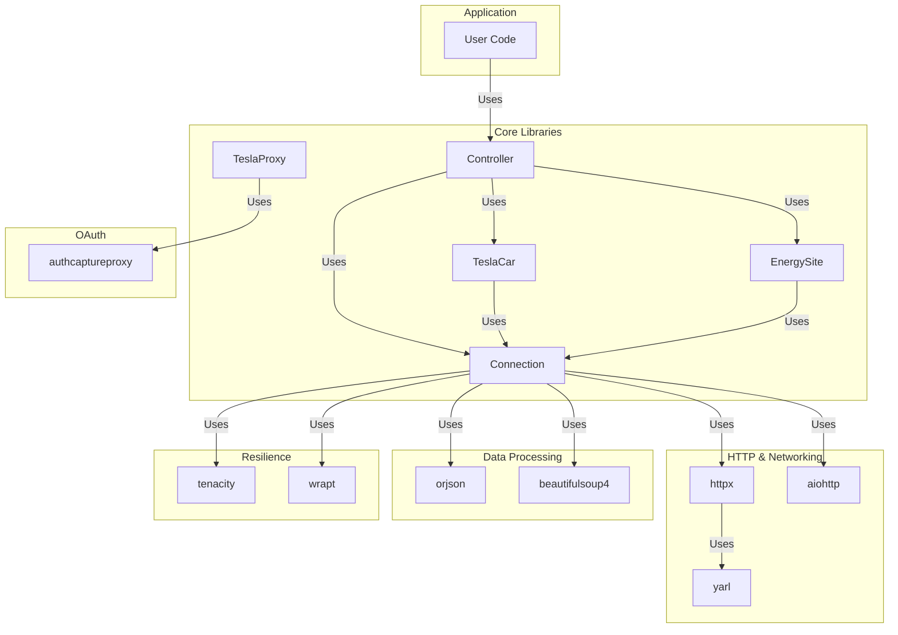

# Dependencies

## Runtime Dependencies

### HTTP & Networking

**aiohttp** (>=3.7.4)
- Provides: Streaming HTTP client with WebSocket support
- Used for: Initial HTTP setup, alternative to httpx
- Why chosen: Mature async HTTP library with WebSocket support

**httpx** (>=0.17.1, <1.0)
- Provides: Modern async HTTP client
- Used for: Primary HTTP client for API calls
- Why chosen: Better async/await ergonomics than aiohttp

**yarl** (dependency of httpx)
- Provides: URL parsing and manipulation
- Used for: URL handling in Connection class

### Authentication & Security

**authcaptureproxy** (>=1.1.3)
- Provides: OAuth proxy server framework
- Used for: TeslaProxy class for OAuth redirect capture
- Why chosen: Handles OAuth flow interception

### Data Processing

**orjson** (>=3.8.5)
- Provides: Fast JSON parsing and serialization
- Used for: JSON encoding/decoding in API calls
- Why chosen: Significantly faster than standard json module

**beautifulsoup4** (>=4.9.3)
- Provides: HTML/XML parsing
- Used for: Parsing OAuth response HTML
- Why chosen: Robust HTML parsing for Tesla OAuth pages

### Resilience

**tenacity** (>=8.1.0)
- Provides: Retry decorator with various strategies
- Used for: Automatic retry with exponential backoff
- Why chosen: Industry-standard retry library

**wrapt** (>=1.12.1)
- Provides: Function wrapping utilities
- Used for: Decorator implementation
- Why chosen: Proper function wrapper handling

## Development Dependencies

### Testing

**pytest** (>=6.2.2)
- Unit test framework
- Configuration: `setup.cfg` with `[tool:pytest]` section
- Test location: `tests/unit_tests/`

**pytest-asyncio** (>=0.14.0)
- Async/await support for pytest
- Enables: `async def test_*()`

**pytest-cov** (>=2.11.1)
- Code coverage reporting
- Target: 100% coverage required

**coverage** (>=5.5)
- Coverage analysis tool
- Configuration: `.coveragerc`

### Code Quality

**flake8** (>=3.9.0)
- PEP 8 style guide enforcement
- Configuration: `setup.cfg` with `[flake8]` section

**pylint** (>=2.7.3)
- Advanced code analysis
- Configuration: `pylintrc`

**pydocstyle** (>=6.0.0)
- Docstring style checking

**black** (>=20.8b1)
- Automatic code formatting
- Configuration: `pyproject.toml` with `[tool.black]` section

### Type Checking

**mypy** (>=0.812)
- Static type analysis
- Used for: Verifying type hints throughout codebase

### Documentation

**Sphinx** (>=3.5.3)
- Documentation generator
- Configuration: `docs/conf.py`

**sphinx-rtd-theme** (>=0.5.1)
- Read the Docs theme for Sphinx

**sphinx-autoapi** / **autoapi** (>=2.0.1)
- Automatic API documentation from docstrings

**m2r2** (>=0.3.1)
- Markdown to reStructuredText converter

**sphinx-copybutton** (>=0.3.1)
- Copy button for code blocks in docs

### Build & Distribution

**Poetry** (via pyproject.toml)
- Dependency management and packaging
- Configuration: `pyproject.toml`
- Build backend: `poetry-core>=1.0.0`

**tox** (>=3.23.0)
- Testing across multiple environments
- Configuration: `tox.ini`

## External Systems

### Tesla API

**Owner API** (Legacy)
- Base URL: `https://owner-api.teslamotors.com`
- Used for: Vehicle commands and state
- Status: Active but deprecated for new vehicles
- Endpoints: `/api/1/vehicles`, `/api/1/vehicles/{id}/command/*`

**WebSocket Streaming**
- URL: `wss://streaming.vn.teslamotors.com/streaming`
- Used for: Real-time vehicle event streaming
- Format: JSON messages with vehicle tokens
- Benefits: Lower latency than polling

**OAuth Server**
- Base URL: `https://auth.tesla.com`
- Used for: User authentication
- Method: OAuth2 with PKCE (Proof Key for Code Exchange)
- Token types: access_token, refresh_token, id_token

**China Regional API**
- Base URL: `https://owner-api.vn.cloud.tesla.cn`
- Used for: Vehicles in China
- Automatically selected based on auth_domain

### Fleet API (Modern/Optional)

**Tesla HTTP Proxy**
- Purpose: Modern vehicles require command proxy
- Setup: Self-hosted container with Tesla's vehicle-command
- Authentication: Client ID + Bearer token
- VIN requirement: Commands must use VIN instead of vehicle_id
- Self-signed cert: Optional support via cert_path parameter

## Dependency Graph



## Dependency Compatibility

### Python Version Support

- Minimum: Python 3.7
- Tested: Python 3.7, 3.8, 3.9 (per classifiers)
- Type hints: Full typing support throughout

### Breaking Changes to Monitor

**httpx >= 0.17.1 < 1.0**
- Constraint prevents httpx 1.0 which has breaking changes
- Should be reviewed and updated when httpx 1.0 released

**tenacity >= 8.1.0**
- Retry behavior changes in major versions
- Current version: 8.x line

## Dependency Installation

### Production Installation

```bash
pip install teslajsonpy
# or
poetry install --no-dev
```

### Development Installation

```bash
poetry install
# Installs all runtime + dev dependencies
```

### From Source

```bash
git clone https://github.com/zabuldon/teslajsonpy.git
cd teslajsonpy
make init        # Install poetry
poetry install   # Install all dependencies
poetry shell     # Enter virtual environment
```

## Updating Dependencies

### Dependency Update Process

1. **Update pyproject.toml** with new version constraints
2. **Run**: `poetry update` to update poetry.lock
3. **Run**: `make lint` and `make typing` for quality checks
4. **Run**: `make coverage` for tests
5. **Review**: Changes in behavior or API

### Recent Dependency Notes

**Python Version Deprecation**
- Python 3.6 and earlier not supported
- Minimum Python 3.7 (per pyproject.toml)

**Type Checking Status**
- Full type hints in main codebase
- mypy strictness enabled in CI

## Optional Dependencies

### For Fleet API (HTTP Proxy)

If using modern vehicles with HTTP proxy:

1. **Set up Tesla HTTP Proxy** (self-hosted)
   - Requires: Docker or local installation
   - Reference: Tesla's vehicle-command repository

2. **Provide parameters**:
   ```python
   Controller(
       client_id="your_client_id",
       api_proxy_url="https://proxy:4430",
       cert_path="/path/to/cert.pem"  # If self-signed
   )
   ```

### For Home Assistant Integration

Home Assistant typically wraps teslajsonpy with:

- **async_timeout** - Timeout handling
- **aiofiles** - Async file operations
- **attrs** - Class definitions
- **yarl** - URL handling (transitive)

## License Compatibility

All dependencies are open-source with compatible licenses:

| Package | License | Compatible |
|---------|---------|-----------|
| httpx | BSD | ✓ |
| aiohttp | Apache 2.0 | ✓ |
| yarl | Apache 2.0 | ✓ |
| orjson | MIT + Apache 2.0 | ✓ |
| beautifulsoup4 | MIT | ✓ |
| tenacity | Apache 2.0 | ✓ |
| wrapt | BSD | ✓ |
| authcaptureproxy | Apache 2.0 | ✓ |

## Performance Characteristics

### HTTP Performance

- **httpx**: Modern, optimized HTTP/2 support
- **Connection pooling**: Built into httpx AsyncClient
- **Keep-alive**: Maintained across requests

### JSON Performance

- **orjson**: ~2-3x faster than standard json
- **Serialization**: Faster for large vehicle data
- **Memory**: More efficient encoding/decoding

### Async Performance

- **Non-blocking I/O**: All network operations async
- **Concurrent**: Multiple vehicles polled concurrently
- **WebSocket**: Real-time updates with minimal latency

## Troubleshooting Dependencies

### Module Not Found

```python
# Error: ModuleNotFoundError: No module named 'httpx'
# Solution: poetry install or pip install httpx
```

### Version Conflicts

```bash
# Check installed versions
poetry show

# Update to latest
poetry update dependency_name

# Lock specific version
poetry lock --no-update
```

### Type Checking Issues

```bash
# Run mypy
make typing

# Or directly
poetry run mypy teslajsonpy --strict
```

## Future Dependency Considerations

### Potential Upgrades

1. **httpx 1.0** - Review breaking changes when released
2. **Python 3.12** - Update when EOL policies allow
3. **Async stdlib** - Consider native asyncio APIs as they improve

### Alternative Implementations

If dependency compatibility issues arise:

- **aiohttp** can replace httpx (already used for streaming)
- **requests-async** alternative if httpx causes issues
- **stdlib json** if orjson compatibility issues
