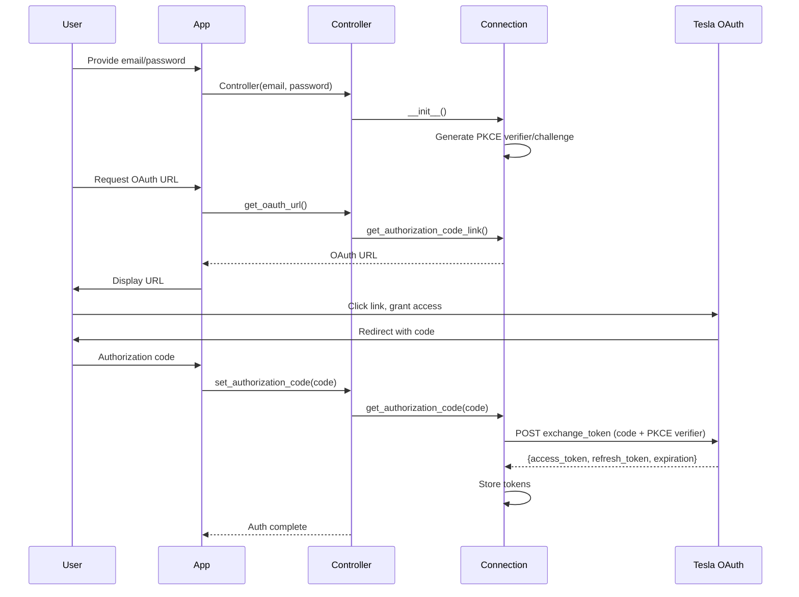
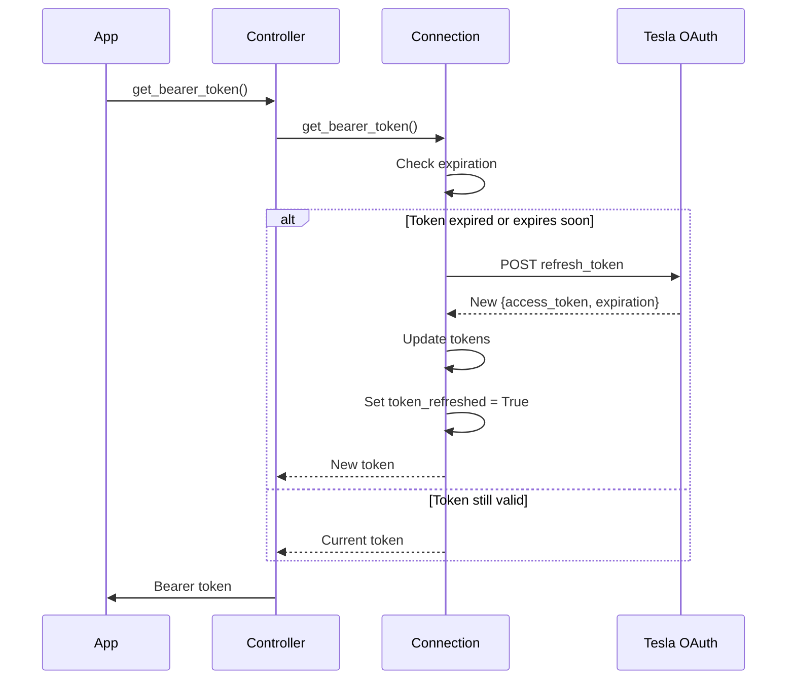
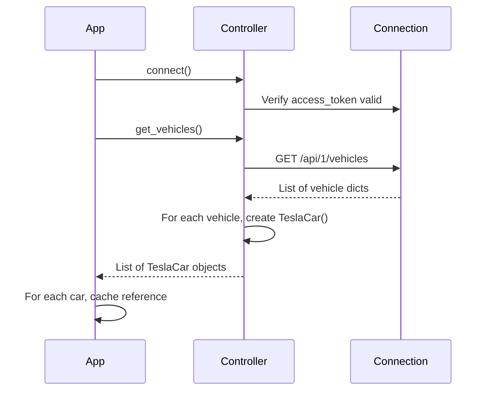
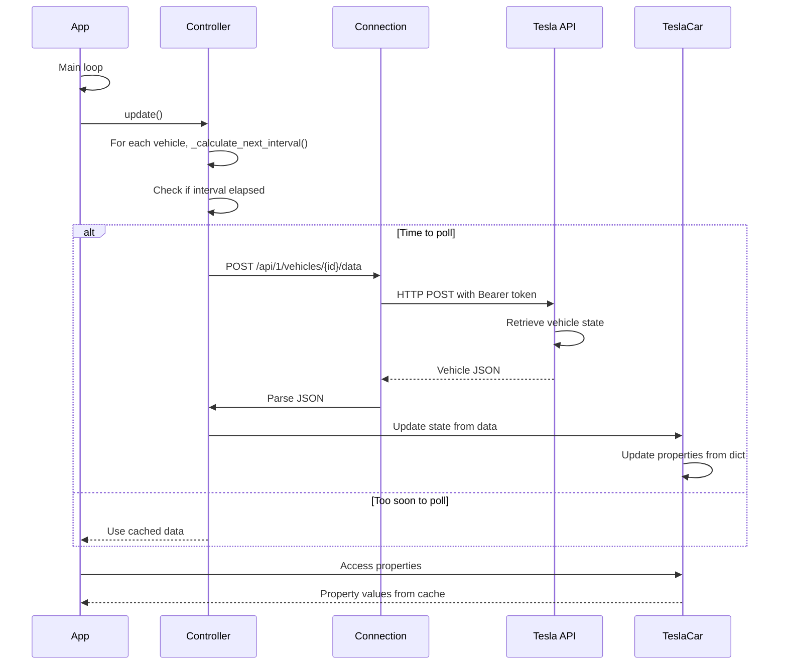
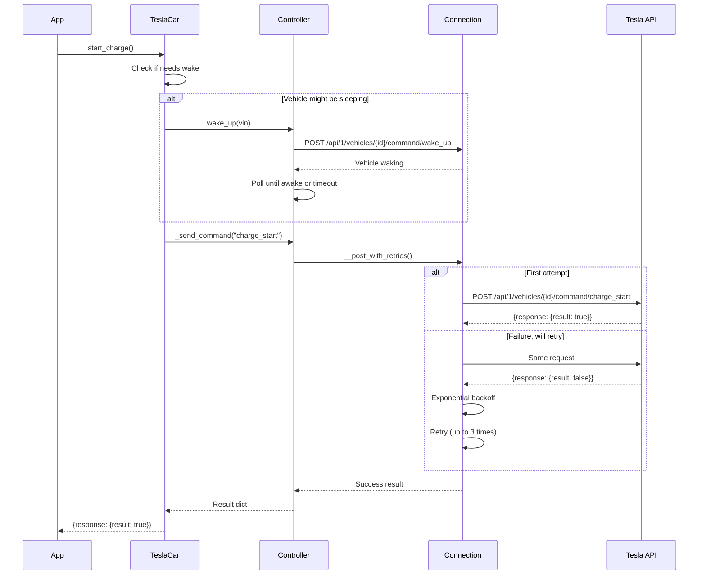
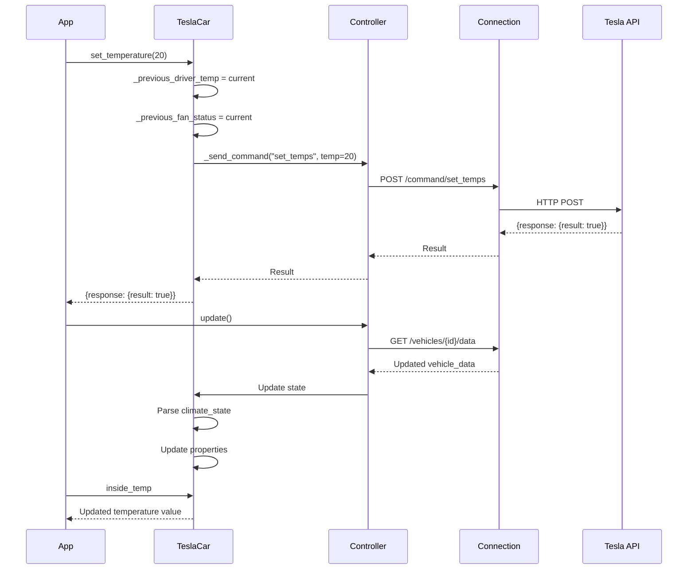
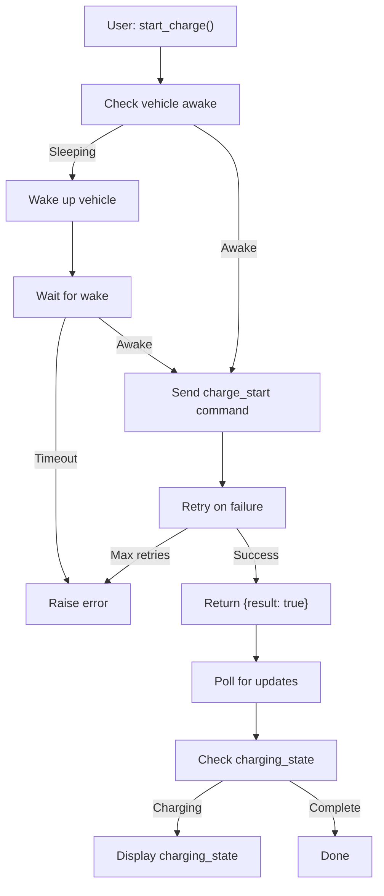
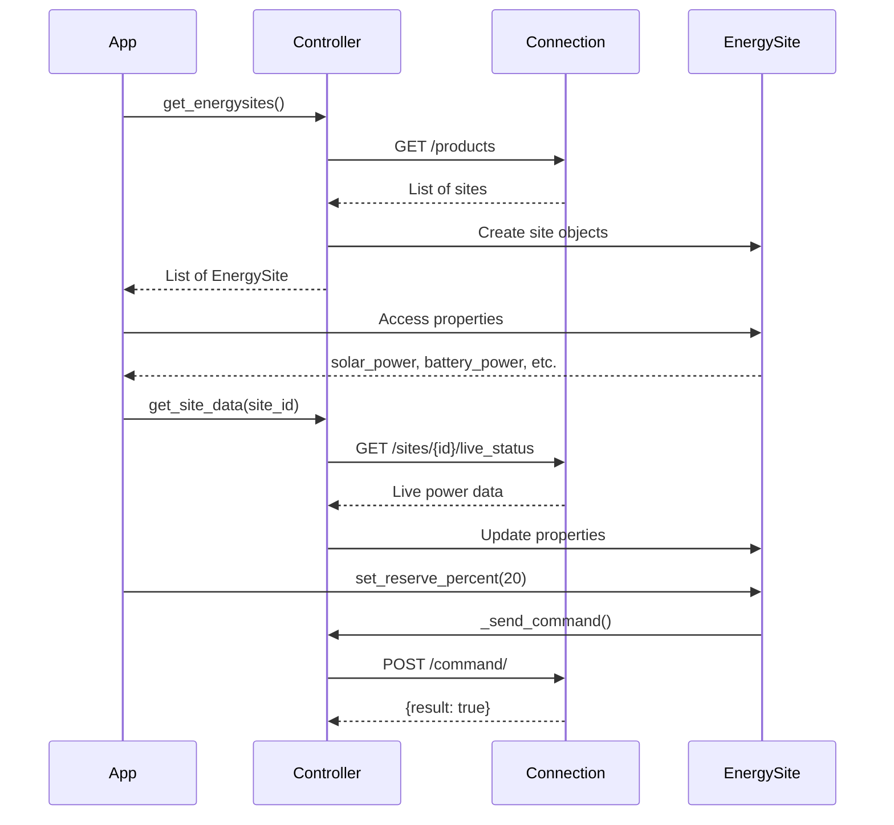
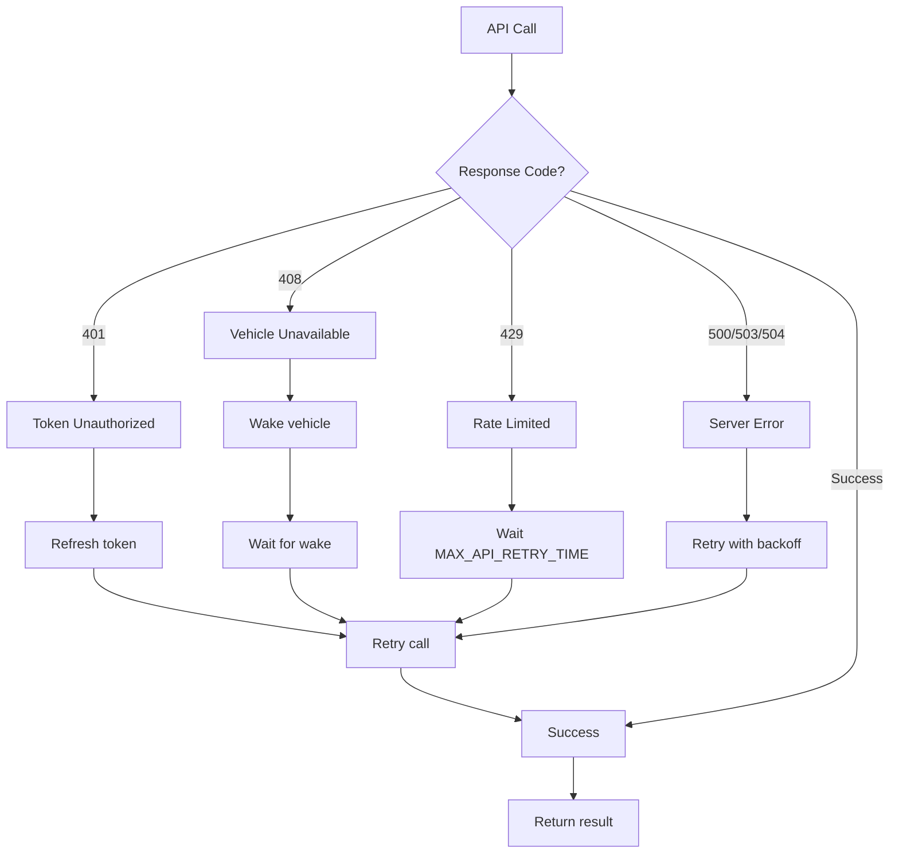

# Workflows

## Key Processes and Data Flows

This document describes the major workflows and processes in teslajsonpy.

## Workflow 1: Initial Authentication

The OAuth2 authentication flow for users logging in.



### Code Example

```python
async def authenticate():
    async with AsyncClient() as session:
        controller = Controller(
            websession=session,
            email="user@example.com",
            password="password",
        )
        
        # Get OAuth URL
        oauth_url = await controller.get_oauth_url()
        print(f"Visit: {oauth_url}")
        
        # User grants access, receives code
        code = input("Enter authorization code: ")
        
        # Exchange code for tokens
        await controller.set_authorization_code(code)
        
        # Store tokens for later use
        tokens = await controller.get_tokens()
        save_tokens(tokens)
```

## Workflow 2: Token Refresh

Automatic token refresh when token is about to expire.



### Code Example

```python
# Automatic - happens in background
await controller.connect()

# Check if refreshed
if await controller.is_token_refreshed():
    tokens = await controller.get_tokens()
    save_tokens(tokens)  # Persist for next session

# Or use stored tokens on next startup
tokens = load_tokens()
controller = Controller(
    websession=session,
    access_token=tokens['access_token'],
    refresh_token=tokens['refresh_token'],
    expiration=tokens['expiration'],
)
```

## Workflow 3: Vehicle Discovery

Finding and initializing vehicles.



### Code Example

```python
await controller.connect()

vehicles = await controller.get_vehicles()

for car in vehicles:
    print(f"Vehicle: {car.display_name}")
    print(f"  VIN: {car.vin}")
    print(f"  State: {car.state}")
    print(f"  Battery: {car.battery_level}%")
```

## Workflow 4: Vehicle State Polling

Periodic polling of vehicle data.



### Polling Interval Selection

```
if vehicle.state == "DRIVING":
    interval = 60 seconds
else if vehicle.power_state == "Drive":
    interval = 60 seconds
else if parked < 15 minutes ago:
    interval = 300 seconds (5 min)
else if parked < 11 minutes ago:
    interval = 600 seconds (10 min)
else:
    interval = 660 seconds (11 min, don't poll)
```

### Code Example

```python
async def poll_loop():
    await controller.connect()
    
    while True:
        # Poll all vehicles
        await controller.update()
        
        # Access cached data
        vehicles = await controller.get_vehicles()
        for car in vehicles:
            print(f"{car.display_name}: {car.battery_level}%")
        
        # Wait before next poll
        await asyncio.sleep(10)
```

## Workflow 5: Command Execution

Executing a command on a vehicle.



### Retry Logic

```python
# Built-in retry with exponential backoff
@custom_retry(retries=3, wait_time=1)
async def post(command, **kwargs):
    # Retry up to 3 times
    # Wait time: 1s, 2s, 4s between attempts
    ...

@custom_retry_except_unavailable()
async def post_with_wake(command, **kwargs):
    # Retry on most errors
    # But NOT on 408 (vehicle unavailable)
    # Because we already woke the vehicle
    ...
```

### Code Example

```python
async def charge():
    car = (await controller.get_vehicles())[0]
    
    try:
        result = await car.start_charge()
        if result['response']['result']:
            print("Charge started")
        else:
            print(f"Failed: {result['response']['reason']}")
    except TeslaException as e:
        if e.code == 408:
            print("Vehicle unavailable")
        elif e.code == 401:
            print("Unauthorized")
        else:
            print(f"Error: {e.message}")
```

## Workflow 6: WebSocket Real-Time Updates

Receiving real-time updates via WebSocket.

```mermaid
sequenceDiagram
    App->>Controller: register_websocket_callback(callback_func)
    Controller->>Connection: websocket_connect()
    Connection->>Tesla WebSocket: Connect to wss://streaming...
    Tesla WebSocket-->>Connection: Establish connection
    loop Real-time updates
        Tesla WebSocket->>Connection: Vehicle event message
        Connection->>Connection: Parse message
        Connection->>Controller: _process_messages()
        Controller->>TeslaCar: Update state
        Controller->>App: Invoke callback(event)
        App->>App: Handle update
    end
```



### Message Format

WebSocket messages contain vehicle tokens and field updates:

```python
{
    "msg_type": "data:update",
    "token": ["token1"],               # Identifies which car
    "data": {
        "state": 0,                    # Vehicle state
        "shift_state": "D",            # Current shift
        "speed": 45,                   # Current speed
        "power": 50,                   # Power draw
        "soc": 75,                     # Battery percent
        "elevation": 100,              # Elevation
        "est_range": 200,              # Estimated range
        "est_lat": 40.7128,           # Latitude
        "est_lng": -74.0060,          # Longitude
    }
}
```

### Code Example

```python
async def handle_update(msg):
    if msg.get('msg_type') == 'data:update':
        data = msg.get('data', {})
        print(f"Battery: {data.get('soc')}%")
        print(f"Speed: {data.get('speed')} mph")

await controller.register_websocket_callback(handle_update)

# Now receive real-time updates
```

## Workflow 7: Climate Control

Setting vehicle climate and seat temperatures.



### Code Example

```python
car = (await controller.get_vehicles())[0]

# Set climate
await car.set_temperature(20.5)
await car.set_hvac_mode("cool")
await car.set_climate_keeper_mode(1)  # Dog mode

# Set seats
await car.set_heated_steering_wheel_level(2)
await car.remote_seat_heater_request("left", 3)

# Poll for updates
await controller.update()
print(f"Current temp: {car.inside_temp}°C")
```

## Workflow 8: Charging Sequence

Complete charge start and monitoring.



### Code Example

```python
async def charge_and_monitor():
    car = (await controller.get_vehicles())[0]
    
    # Start charging
    result = await car.start_charge()
    print(f"Charge started: {result['response']['result']}")
    
    # Monitor charging
    for i in range(60):  # 60 seconds
        await controller.update()
        
        state = car.charging_state
        percent = car.battery_level
        rate = car.charge_rate
        
        print(f"[{i}s] {state}: {percent}% (+{rate} mi/h)")
        
        if car.charging_state == "Complete":
            print("Charging complete!")
            break
        
        await asyncio.sleep(1)
```

## Workflow 9: Energy Site Monitoring

Monitoring and controlling energy resources.



### Code Example

```python
sites = await controller.get_energysites()

for site in sites:
    print(f"Site: {site.site_name}")
    print(f"  Solar: {site.solar_power}W")
    print(f"  Battery: {site.battery_power}W")
    print(f"  Grid: {site.grid_power}W")
    print(f"  Load: {site.load_power}W")
    
    # Set backup reserve
    await site.set_reserve_percent(20)
    
    # Set operation mode
    await site.set_operation_mode("self_consumption")
```

## Workflow 10: Error Recovery

Handling common error scenarios.



### Code Example

```python
from teslajsonpy import TeslaException

async def safe_command(command_func):
    max_retries = 3
    for attempt in range(max_retries):
        try:
            return await command_func()
        except TeslaException as e:
            print(f"Error {e.code}: {e.message}")
            
            if e.code == 401:
                print("Refreshing token...")
                await controller.connect()
            elif e.code == 408:
                print("Waking vehicle...")
                await controller.wake_up(vin)
            elif e.code == 429:
                print("Rate limited, waiting...")
                await asyncio.sleep(15)
            else:
                raise
            
            if attempt < max_retries - 1:
                await asyncio.sleep(1)  # Wait before retry
        except Exception as e:
            print(f"Unexpected error: {e}")
            raise
```

## Workflow 11: Multi-Vehicle Coordination

Managing multiple vehicles with polling optimization.

```python
async def multi_vehicle_monitor():
    await controller.connect()
    
    vehicles = await controller.get_vehicles()
    print(f"Found {len(vehicles)} vehicles")
    
    # Poll interval is per-vehicle and adaptive
    # Controller handles all timing
    while True:
        await controller.update()
        
        for car in vehicles:
            if car.state != "online":
                continue
            
            print(f"{car.display_name}:")
            print(f"  Battery: {car.battery_level}%")
            print(f"  State: {car.charging_state}")
            print(f"  Location: {car.latitude:.4f}, {car.longitude:.4f}")
        
        await asyncio.sleep(10)
```

## Workflow 12: Scheduled Operations

Setting up recurring operations.

```python
async def scheduled_operations():
    await controller.connect()
    
    car = (await controller.get_vehicles())[0]
    
    # Schedule charging
    tomorrow_8am_minutes = (8 * 60)  # 8 AM as minutes from midnight
    await car.set_scheduled_charging(
        start_time=tomorrow_8am_minutes,
        enable=True
    )
    
    # Schedule departure
    tomorrow_9am_minutes = (9 * 60)
    await car.set_scheduled_departure(
        departure_time=tomorrow_9am_minutes,
        enable=True,
        preconditioning_enabled=True
    )
    
    print("Scheduled charging and departure for tomorrow")
```
